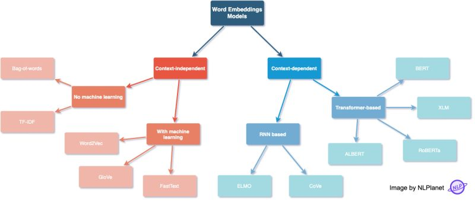
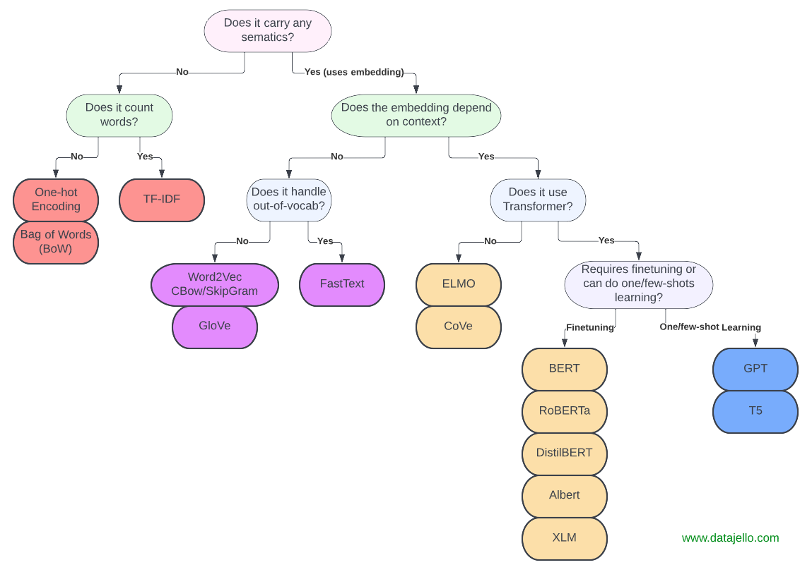

# Overview of word embeddings category

The picture below is the sumary of  word representation in NLP

# Word embedding models

## Context - independent

We use this approaches when we have a simple task which not involve **semantics** and **context**

Suppose that we have these example document:

* **Document 1** : "The cat sat on the mat."
* **Document 2** : "The dog barked."

### Context - independent without machine learning

#### One hot encoding

Encodes individual words or characters as binary vectors.

Vocabulary:

`["the", "cat", "sat", "on", "mat", "dog", "barked"]`

Each word is represented as a binary vector with one "1" at the word's position in the vocabulary.

* **"cat"** → `[0, 1, 0, 0, 0, 0, 0]`
* **"dog"** → `[0, 0, 0, 0, 0, 1, 0]`

When to use:

* For simple tasks like basic NLP preprocessing.
* As input to machine learning models when relationships between words aren't needed.

#### Bag of Words (BoW)

Represents documents based on word frequencies in the vocabulary.

* **Document 1** : `[2, 1, 1, 1, 1, 0, 0]`. "the" appears 2 times. "cat", "sat", "on", "mat" appear 1 time each.
* **Document 2** : `[1, 0, 0, 0, 0, 1, 1]`. "the" appears 1 time, "dog" and "barked" appear 1 time each.

When to use :

* For text classification or clustering where word frequency is important.
* For tasks with a small vocabulary or corpus size.

#### TF-IDF

Represents documents by weighting word importance (frequency × rarity). The intuition behind this measure, is that a term (word) is very important if it appears many times inside a document AND the number of documents that the this term is present, is relatively small.

* **TF (Term Frequency):** Highlights terms frequently appearing in a specific document.
* **IDF (Inverse Document Frequency):** Reduces the importance of terms common across all documents (e.g., "the", "and").

When to use:

* For information retrivial, input is a query and the target is to check which document is relevant
* For text classificaiton, convert text to TF-IDF Vectors, then use the TF-IDF vectors as input features to a classification algorithm (e.g., Logistic Regression, SVM, Random Forest).
* **TF-IDF** effectively reduces the noise from common words, making it more useful when dealing with larger corpora. While BoW can create overly sparse and uninformative features in large vocabularies.
* Use TF-IDF when your dataset contains many high-frequency but non-informative words, the importance of these words is neutralized by TF-IDF, but it is escalated by BoW.

### Context - independent with machine learning

#### Word2Vec/Doc2Vec

Word2Vec learns dense vector representations (embeddings) of words based on their contextual usage in a corpus. It assumes words appearing in similar contexts have similar meanings.

**Models** :

1. **Continuous Bag of Words (CBOW)** :

* Predicts a target word based on its surrounding context words.
* Example: For the sentence "The cat sat on the mat," CBOW might predict "sat" from ["The", "cat", "on", "the", "mat"].
* Fast and efficient.

2. Skip Gram

* Predicts the surrounding context words given a target word.
* Example: Given "sat," predict ["The", "cat", "on", "the", "mat"].
* Better for infrequent words.

**Strengths** :

* Efficient training.
* Captures semantic relationships like  **king - man + woman = queen** .
* Produces high-quality embeddings with relatively small datasets.

 **Limitations** :

* Each word has a single vector representation, so it doesn't account for polysemy (e.g., "bank" as a financial institution vs. a riverbank).

Note :

Doc2Vec extends **Word2Vec** to represent entire documents (or paragraphs) as fixed-length vectors, rather than just individual words. These document embeddings capture semantic and syntactic information about the text.

Both **Word2Vec** and **Doc2Vec** are **unsupervised learning** algorithms but more like **self-supervised**

* These models learn embeddings (dense vector representations) by analyzing the structure of the input text without requiring explicit labels or annotations.
* They create their own pseudo-labels from the data (e.g., predicting missing words or surrounding words) and optimize to predict these labels during training.

#### Glove

GloVe learns word embeddings by factorizing a word-word co-occurrence matrix. It focuses on the statistical properties of the entire corpus rather than processing it sequentially like Word2Vec.

 **Mechanism** :

* Constructs a co-occurrence matrix where each cell represents how often a word co-occurs with another in a given window size.
* Learns embeddings such that the dot product between word vectors approximates the logarithm of their co-occurrence probability.

 **Strengths** :

* Captures both global corpus-level statistics (via co-occurrence) and local context.
* Embeddings are robust and perform well across tasks.

 **Limitations** :

* Training can be slower than Word2Vec for large corpora.
* Requires significant memory to store the co-occurrence matrix.

#### Fastext

FastText extends Word2Vec by representing words as a sum of character-level n-gram embeddings, allowing it to model subword information.

 **Features** :

* Breaks each word into overlapping subword n-grams (e.g., "hello" → ["he", "hel", "ell", "lo"]).
* Embedding for a word is the sum of its subword embeddings.

 **Strengths** :

* Handles **out-of-vocabulary (OOV)** words by composing embeddings from subwords, which Word2Vec and GloVe cannot.
* Captures morphological details, making it effective for morphologically rich languages (e.g., Turkish, Finnish).

 **Limitations** :

* Training is computationally more expensive than Word2Vec.
* Embedding quality depends on the choice of n-gram size.

## Context - dependent

### Transformer based

#### Fine-tuning required

##### Monolingual, multilingual tasks

Related to the model perform task in a single language or tasks that don’t require strong cross-lingual understanding. Examples:

- Sentiment analysis in English
- entity recognition in French.

Some popular model related to Monolingual, multilingual tasks:

- 𝗕𝗘𝗥𝗧: This is a transformer-based language representation model trained on a large cross-domain corpus, which uses a masked language model to predict words that are randomly masked in a sequence.
- 𝗥𝗼𝗕𝗘𝗥𝗧𝗮: This is built on BERT and modifies key hyperparameters, removing the next-sentence pretraining objective and training with much larger mini-batches and learning rates.
- 𝗔𝗟𝗕𝗘𝗥𝗧: This is a parameter-reduction techniques to lower memory consumption and increase the training speed of BERT.

##### Cross-lingual tasks

Related to tasks in Natural Language Processing (NLP) where a system is required to work across multiple languages, often require knowledge transfer between languages. It is trained using parallel data to align representations across languages. Example:

- A user enters a query in English ("best tourist spots in Vietnam"), but the search engine retrieves articles written in Vietnamese.

Some popular model related to Cross-lingual tasks:

- XLM
- XLM Roberta

#### One/few short learning

##### **GPT**

Generative Pre-trained Transformer : It's the Decoder-only Transformer which focus on Autoregressive generation (predicting the next token). It processes input in one direction (left-to-right) and focus on generating output by decoding from context. Ideal for tasks like text completion, dialogue generation, or creative writing. Ex :

- Input: "Write a story about a robot", Output: "[Story content]."
- For the input "The cat sat on the", the model predicts "mat."

Some popular model :

* GPT-3
* GPT-4

##### **T5**

Text-to-Text Transfer Transformer : It's the Encoder-Decoder Transformer which focus on Text-to-text format for any NLP task. Processes input bidirectionally in the encoder and Transforms input text into output text (sequence-to-sequence). Handles all tasks in a text-to-text format. Ex:

* summarization
* classification
* translation

Some popular model :

* T5 : The original T5 model from Google, designed for converting NLP tasks into a text-to-text format. Applications : Summarization, translation, question answering.
* Flan-T5 : A fine-tuned version of T5 with a mixture of tasks.(Summarization, QA ..). It can also applicable for Few-shot(The model can perform a task by seeing only a small number of examples) and zero-shot learning(The model performs a task without seeing any explicit examples during training or in the prompt).
* mT5 : A multilingual version of T5 that supports over 100 languages, trained on a diverse set of multilingual corpora. Applications : Multilingual translation, cross-lingual tasks, multilingual text generation.
* ByT5(Byte-Level T5):  : A version of T5 that operates on raw bytes instead of tokenized text, enabling better handling of non-standard text (e.g., typos, rare languages). Applications on Tasks involving noisy or low-resource text data.

### RNN based

#### Standard RNNs

An **RNN (Recurrent Neural Network)** is a type of neural network designed to process sequential data. Unlike traditional **Feed-Forward Neural Networks (FNNs)** that take a fixed-sized input and produce a fixed-sized output in one step, RNNs process input sequences element by element. At each step, RNNs maintain a **hidden state** that captures information about previous inputs, allowing them to handle temporal or sequential dependencies. Key Difference Between FNN and RNN :

**Feed-Forward Neural Networks (FNNs)** :

* Process the entire input at once.
* Do not consider the order of inputs or temporal relationships.

**Recurrent Neural Networks (RNNs)** :

* Process input sequentially, one element at a time.
* Maintain a hidden state that evolves with each step to store contextual information about previous inputs.

**Issues of Standard RNNs**

**1. Vanishing Gradient :**

* Gradients become very small during backpropagation, making it difficult for the network to learn long-term dependencies.
* Common in problems requiring a long memory of previous inputs, like text generation and machine translation.

**2. Exploding Gradient** :

* Gradients grow excessively large during backpropagation, leading to instability and ineffective training.
* This issue occurs less frequently but can significantly disrupt training when it happens.

[Visualizing A Neural Machine Translation Model] https://jalammar.github.io/visualizing-neural-machine-translation-mechanics-of-seq2seq-models-with-attention/

#### Variation Of Recurrent Neural Network (RNN)

To address the limitations of standard RNNs (e.g., vanishing/exploding gradients), several advanced architectures have been developed:

##### **1. Bidirectional RNN (BiRNN)**

* Processes input in both forward and backward directions.
* Combines outputs from both directions to leverage contextual information from the past and the future.
* Useful for tasks like **NLP** and  **time-series analysis** , where understanding context is critical.
* **Correction** : BiRNN does not directly solve the vanishing gradient problem but provides richer context.

##### **2. Long Short-Term Memory (LSTM)**

* Incorporates **gates** to control the flow of information:
  * **Forget Gate** : Determines what information to discard.
  * **Input Gate** : Decides what new information to store.
  * **Output Gate** : Controls the final output from the cell state.
* Effectively learns long-term dependencies by mitigating the vanishing gradient problem.
* Often used for tasks like  **machine translation** ,  **speech recognition** , and  **text generation**.

##### 3. Bidirectional LSTM

**Bidirectional LSTM** is a specific type of Bidirectional RNN that uses **LSTM cells** instead of vanilla RNN cells. Key features :

**Uses LSTM Cells** :

* LSTMs (Long Short-Term Memory networks) solve the vanishing gradient problem by introducing **gates** (forget, input, output) to manage the flow of information.

**Bidirectionality** :

* Similar to Bidirectional RNN, it processes the input sequence in both forward and backward directions.

**Outputs** :

* Combines the outputs of the forward and backward LSTMs to produce richer representations.

**Advantages** :

* Handles long-term dependencies better than Bidirectional RNNs.
* More robust for tasks requiring context from both past and future.

**Models example(ELMO and Cove)**

| **Feature**       | **ELMo**                 | **CoVe**                           |
| ----------------------- | ------------------------------ | ---------------------------------------- |
| **Training Task** | Language modeling              | Machine translation (English-to-German)  |
| **Architecture**  | Stacked Bidirectional LSTMs    | Bidirectional LSTMs                      |
| **Corpus Size**   | Large-scale language data      | Limited bilingual data                   |
| **Performance**   | More robust and widely adopted | Early precursor to contextual embeddings |
| **Applications**  | General-purpose NLP            | Translation and basic NLP                |

##### **4. Gated Recurrent Units (GRUs)**

* A simplified version of LSTMs with fewer parameters and computational overhead.
* Includes two main gates:

  * **Update Gate** : Determines how much of the previous state to carry forward.
  * **Reset Gate** : Controls how much past information to forget.

  No Input and Output Gates in GRUs because In GRUs, the function of determining how much new information to add is implicitly handled by the **update gate**. Also GRUs use the **final hidden state **h_t**** directly as the output, so there's no need for a separate gate to modulate the output like in LSTMs.
* Performs comparably to LSTMs in many tasks but is more efficient.
