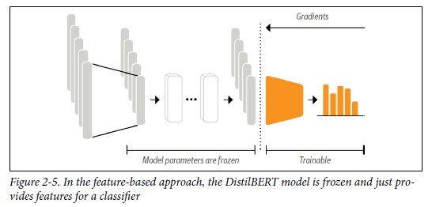

# Natural Language Processing with Transformers

### Chapter 2. Text classification

There are 2 ways of training a text classifier

- Feature extraction
- Fine-tuning

**Training text classifier using feature extraction**
Using a transformer as a feature extractor is fairly simple. As shown in Figure 2-5, we freeze the body’s weights during training and use the hidden states as features for the classifier. The advantage of this approach is that we can quickly train a small or shallow model. Such a model could be a neural classification layer or a method that does not rely on gradients, such as a random forest. This method is especially convenient if GPUs are unavailable, since the hidden states only need to be precomputed once.




Key steps:

1. Loading the Model and Tokenizer:
   We load the DistilBERT model and tokenizer using AutoModel and AutoTokenizer. The model is placed on the GPU if available.
2. Tokenizing the Dataset:
   The dataset is tokenized with padding and truncation enabled. This converts text into **token IDs**(unique numbers present for the tokens) and **attention masks**(Binary vectors(0 and 1 used to distinguish between real tokens and padding tokens in the input).
3. Extracting Hidden States:
   We define a function extract_hidden_states that processes each batch of inputs, passes them through the model, and retrieves the last hidden state for the [CLS] token (a summary of the input sequence).
4. Mapping the Extraction Function:
   The map() function is used to apply the hidden state extraction across the entire dataset, creating a new hidden_state column.
5. Creating Feature Matrices:
   The hidden states are converted into NumPy arrays to be used as input features for a classifier.
6. Training a Classifier:
   We use a simple Random Forest classifier from Scikit-learn to train on the extracted features and labels.
7. Evaluating the Model:

The classifier is evaluated using the validation set, and a classification report is generated.

**Training text classifier using fine tuning**

The first thing we need is a pretrained DistilBERT model like the one we used in the feature-based approach. The only slight modification is that we use the AutoModelFor
SequenceClassification model instead of AutoModel. The difference is that the AutoModelForSequenceClassification model has a classification head on top of the
pretrained model outputs, which can be easily trained with the base model. We just need to specify how many labels the model has to predict.

```
from transformers import AutoModelForSequenceClassification
num_labels = 6
model = (AutoModelForSequenceClassification
.from_pretrained(model_ckpt, num_labels=num_labels)
.to(device))
```

To train, we just need to specify the hyperparameters, Hugging face will do everything for you

```
training_args = TrainingArguments(output_dir=model_name,
num_train_epochs=2,
learning_rate=2e-5,
per_device_train_batch_size=batch_size,
per_device_eval_batch_size=batch_size,
weight_decay=0.01,
evaluation_strategy="epoch",
disable_tqdm=False,
logging_steps=logging_steps,
push_to_hub=True,
log_level="error")
```

**Error analysis**
Here’s a summary of the main ideas behind the error analysis process described:

1. **Objective**: The goal is to analyze your model’s performance by inspecting the examples where it struggles (high loss) and where it is most confident (low loss). This helps you identify issues like mislabeled data, dataset quirks, or potential biases in the model.
2. **Calculating Loss for Each Sample**:

   - During evaluation, the loss is calculated for each sample in the validation set. Higher loss values indicate predictions that are far from the true label, highlighting challenging examples for the model.
3. **Identifying Problematic Samples**:

   - Sorting the validation samples by loss allows you to easily identify examples where the model’s predictions are poor.
   - These samples often include wrongly labeled data or texts that are inherently difficult to classify due to ambiguity, special characters, or complex phrasing.
4. **Evaluating Model Confidence**:

   - Inspecting samples with low loss (where the model is very confident) helps ensure that the model isn’t relying on irrelevant patterns or shortcuts. Consistent low-loss predictions for certain classes might indicate overconfidence or dataset bias.
5. **Dataset Improvement**:

   - By detecting mislabeled data or ambiguous cases, you can refine your dataset, leading to significant performance gains without needing a larger model or more data.
6. **Conclusion**: Error analysis provides actionable insights for improving model performance by focusing on problematic examples and understanding where the model is struggling or overly confident. This process is a crucial step before fine-tuning or deploying the model.

This approach is a systematic way to improve your model’s accuracy and robustness by addressing underlying issues in the dataset or labeling.

**Saving and sharing the model**

The NLP community benefits greatly from sharing pretrained and fine-tuned models, and everybody can share their models with others via the Hugging Face Hub. Any
community-generated model can be downloaded from the Hub just like we downloaded the DistilBERT model. With the Trainer API, saving and sharing a model is
simple:

```
trainer.push_to_hub(commit_message="Training completed!")
```

### Chapter 7. Question Answering

This text provides an overview of how Question Answering (QA) systems, specifically extractive QA, can be used to efficiently retrieve information from large volumes of text, such as customer reviews. The main points covered include:

1. **Introduction to Question Answering (QA)**: QA systems can automatically retrieve and extract answers from documents in response to user queries. The process involves first retrieving relevant documents and then extracting specific answers from those documents. Google’s ability to answer factual queries like “When did Marie Curie win her first Nobel Prize?” is an example of such a system.
2. **Different Types of QA**: The text highlights various forms of QA:

   - **Extractive QA**: The most common form, where the answer is a span of text directly retrieved from a document.
   - **Community QA**: Involves user-generated question-answer pairs, often found on forums.
   - **Long-form QA**: Generates paragraph-length answers to open-ended questions.
   - **Table QA**: Uses transformer models like TAPAS to answer questions based on data in tables.
3. **Use Case: Review-Based QA System**: The text discusses building a QA system to help consumers answer specific questions about products based on customer reviews. This system can be useful for answering questions that are not easily addressed by the product description alone.
4. **SubjQA Dataset**: The system uses the SubjQA dataset, which contains over 10,000 customer reviews across various domains (e.g., Electronics, Books). The dataset includes subjective questions, which makes the QA task more challenging compared to factual questions. For example, the dataset may involve questions about the quality of a product, where the answer is based on personal opinions rather than objective facts.
5. **Challenges with Subjective QA**: The subjective nature of the questions in the SubjQA dataset means that traditional keyword-based search methods are insufficient, as they cannot capture the nuances required to find relevant answers. This makes the dataset a realistic benchmark for evaluating the performance of QA models on user-generated content.
6. **Dataset Exploration**: The text outlines the process of exploring and preparing the SubjQA dataset for use in a QA system, including flattening the data for easier manipulation and analyzing the types of questions commonly asked.
7. **Comparison with Other QA Datasets**: The SubjQA dataset is compared to other QA datasets like SQuAD and Natural Questions (NQ). While SQuAD focuses on fact-based questions from Wikipedia articles, SubjQA deals with more subjective content from customer reviews, making it a different challenge for QA systems.

This summary emphasizes the importance of QA systems in efficiently extracting relevant information from large, complex datasets, particularly in contexts where user-generated content and subjective opinions are involved.

This section of the text explains how to build a question-answering (QA) system to extract answers from text. It specifically covers the key processes of framing the problem as a span classification task, tokenizing text for QA tasks, and dealing with long passages.

8. **Span Classification for Answer Extraction**:

   - Extracting answers from text is framed as a span classification task. The QA model needs to predict the start and end tokens of the answer span.
   - The use case is highlighted with examples such as extracting “waterproof at 30m” from a review answering the question, “Is it waterproof?”
   - A pre-trained QA model, typically fine-tuned on large datasets like SQuAD, is recommended for starting with small datasets.
9. **Choosing Models for QA Tasks**:

   - A selection of models fine-tuned on SQuAD 2.0 is suggested, including MiniLM, RoBERTa, ALBERT, and XLM-RoBERTa, each offering different trade-offs between speed, accuracy, and multilingual capabilities.
   - The MiniLM model is chosen as it offers a good balance between performance and speed for the task at hand.
10. **Tokenizing Text for QA**:

- Inputs for QA tasks consist of question-context pairs. The tokenizer encodes these inputs, producing input IDs, attention masks, and token type IDs.
- A forward pass through the model provides start and end logits, which are then used to determine the span of the answer.

11. **Dealing with Long Passages**:

- The problem of long passages exceeding the model’s maximum sequence length is addressed by using a sliding window approach. This method divides the text into smaller windows and ensures no critical information is lost through truncation.

12. **Using a Retriever-Reader Architecture**:

- The retriever-reader architecture is introduced as a way to scale QA systems. The retriever identifies relevant documents, while the reader extracts the specific answers from these documents.
- Sparse and dense retrievers are explained, with sparse retrievers like BM25 using word frequency-based methods, while dense retrievers use transformer-based embeddings.

13. **Building a QA System with Haystack**:

- The Haystack library is introduced to build QA systems. It simplifies the integration of retrievers, readers, and document stores.
- Elasticsearch is used as the document store to handle large amounts of data efficiently.

14. **Handling Large Contexts with Elasticsearch**:

- The system handles large document collections by indexing customer reviews in Elasticsearch and using a BM25 retriever to search relevant reviews based on a query.

15. **Evaluating the QA Pipeline**:

- The performance of the QA pipeline is evaluated by metrics like recall, which measures the proportion of relevant documents retrieved by the retriever.

16. **Domain Adaptation:**

- Fine-tuning a model like MiniLM, which was initially trained on SQuAD, on a domain-specific dataset like SubjQA can dramatically improve performance metrics such as Exact Match (EM) and F1 scores.
- The text illustrates how to convert data into the SQuAD JSON format, which is required for fine-tuning using the FARMReader. This involves creating functions to structure the data properly and then fine-tuning the model on the domain-specific dataset.

17. **Challenges of Overfitting:**

- Fine-tuning directly on a small dataset like SubjQA might lead to overfitting due to the limited number of training examples (only 1,295 in SubjQA compared to over 100,000 in SQuAD). The text suggests that using SQuAD as a pre-training step before fine-tuning on SubjQA can help mitigate overfitting.

18. **Evaluation of QA Pipeline:**

- After fine-tuning, the text discusses evaluating the overall QA pipeline by integrating both the retriever and reader components. It points out that there may be a degradation in performance when the reader receives multiple contexts from the retriever compared to a SQuAD-style evaluation where the context is directly matched to the question.
- To improve the model's performance, the text suggests allowing the reader to predict multiple possible answers.

19. **Generative QA:**

- The text introduces the concept of generative QA, where instead of extracting answers as spans of text, a model generates answers using a sequence-to-sequence transformer like T5 or BART. This approach, known as Retrieval-Augmented Generation (RAG), can synthesize information across multiple documents to generate more coherent answers.

20. **RAG Models:**

- Two types of RAG models are discussed: RAG-Sequence, which uses the same document to generate the entire answer, and RAG-Token, which allows different documents to contribute to the generation of each token in the answer.
- The text provides code snippets to instantiate and fine-tune a RAG model using the Haystack framework.

21. **Application and Future Directions:**

- The text concludes by emphasizing the importance of carefully choosing and combining different QA techniques depending on the use case. It introduces a "QA hierarchy of needs," starting with search-based methods, followed by extractive methods, and finally generative methods.
- It also touches on exciting future research areas like multimodal QA, QA over knowledge graphs, and automatic question generation using synthetic data.

### Conclusion:

The text provides a comprehensive guide on improving QA models through domain adaptation and introduces more advanced techniques like generative QA with RAG models. It emphasizes the importance of understanding the specific needs of the QA task and choosing the appropriate tools and techniques, whether that’s through traditional extractive methods or more advanced generative approaches. The discussion also highlights the importance of evaluation and iteration to achieve the best performance, especially when adapting models to new domains or tasks.

### Chapter 8. Chapter 10. Training Transformers from Scratch

[Page 318 Training a Tokenizer]
